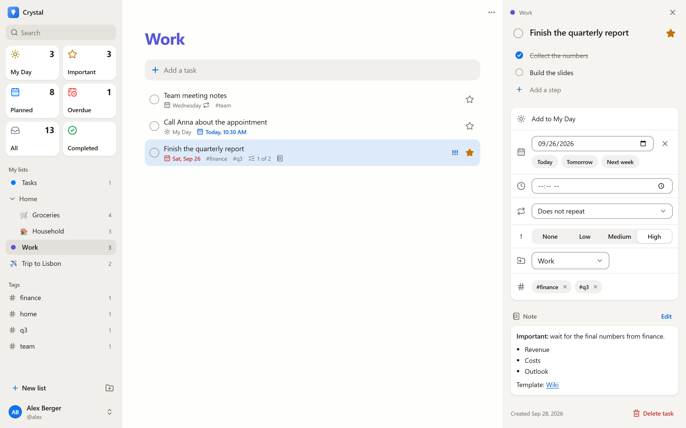
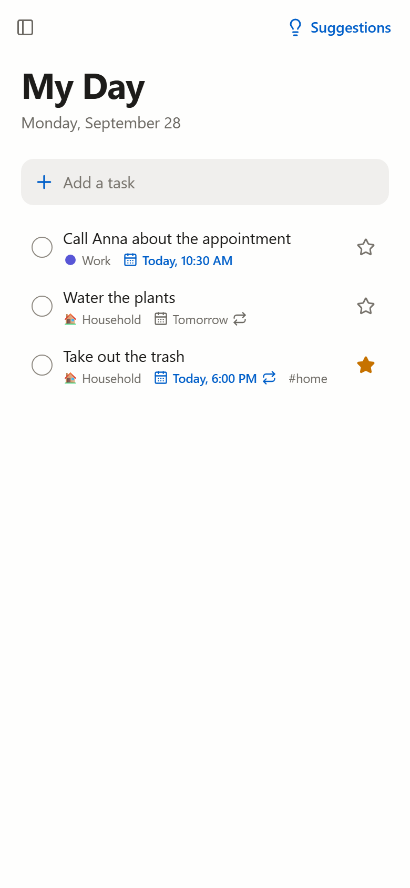
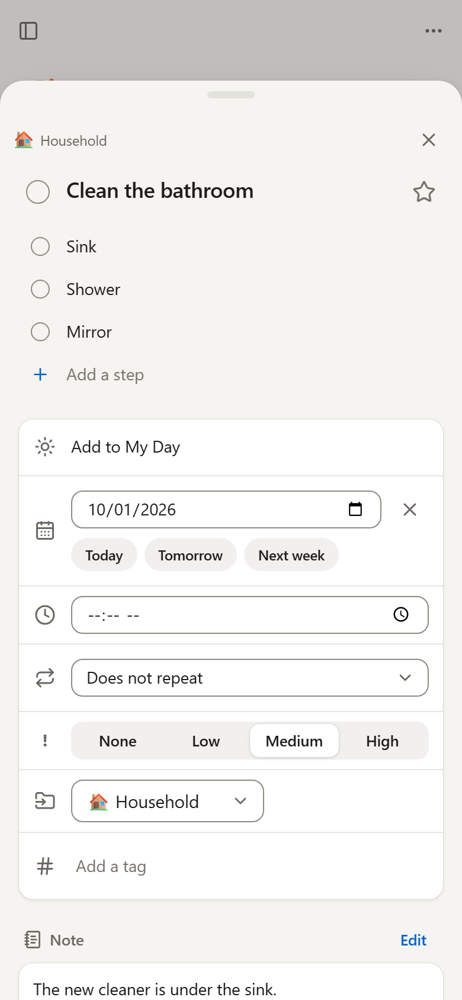

<p align="center">
  
</p>

<h1 align="center">Crystal</h1>

<p align="center">
  A calm, self-hosted to-do app for individuals, families and shared flats.<br />
  Clean design in the spirit of Apple Reminders and Things – running on your own server.
</p>

<p align="center">
  <a href="https://github.com/Lua-x/Crystal/actions/workflows/ci.yml"></a>
  <a href="LICENSE"></a>
</p>

> [!NOTE]
> **Crystal is in early development.** Lists, tasks, repeats, tags and quick entry are
> ready to use; sharing, reminders and offline use follow. See the [roadmap](ROADMAP.md)
> for what comes next.

<p align="center">
  <picture>
    <source media="(prefers-color-scheme: dark)" srcset="docs/screenshots/desktop-dark.png" />
    
  </picture>
</p>

<p align="center">
  <picture>
    <source media="(prefers-color-scheme: dark)" srcset="docs/screenshots/phone-my-day-dark.png" />
    
  </picture>
  &nbsp;
  <picture>
    <source media="(prefers-color-scheme: dark)" srcset="docs/screenshots/phone-details-dark.png" />
    
  </picture>
</p>

## Features

**Lists and tasks**

- **Lists with color and emoji**, grouped into folders, sorted by drag and drop.
- **Tasks with everything you need:** steps (a checklist), due date and time, priority,
  an “important” star and notes with Markdown.
- **My Day** – plan today with suggestions for overdue, soon due and recently added
  tasks. It starts empty again every morning.
- **Smart lists:** Important, Planned (overdue, today, tomorrow, this week, later),
  Overdue, All and Completed – with live counts in the sidebar.
- **Drag and drop** with mouse, touch or keyboard: reorder tasks, drop them onto another
  list, rearrange lists and groups.
- **Fast search** through titles, notes and steps.
- **Undo** for deleted tasks; completed tasks stay tucked away until you need them.
- **Details beside the list** on large screens, as a sheet on phones and tablets.

**Fast to use**

- **Quick entry that understands you**, in English and German: type “Take out the trash
  tomorrow 6pm every Tuesday !important #household” and Crystal sets the date, time, repeat,
  importance and tag. Recognized parts show as chips you can dismiss.
  [What is recognized](docs/quick-entry.md)
- **Repeating tasks** – daily, on chosen weekdays, every n weeks, months or years, counted
  from the due date or from completion. The next one appears when you tick one off.
- **Tags** to cut across lists, each with its own view.
- **Keyboard shortcuts** for everything frequent, and a **command palette** (⌘K / Ctrl+K) to
  jump to any list, find tasks or add one from anywhere. Press `?` for an overview.

**For the whole household**

- **Accounts for everyone in the household.** The first account becomes the administrator.
  Others join with invite links, or registration can be opened or closed entirely.
- **Single sign-on** via OpenID Connect (Authentik, Keycloak, Authelia, Pocket ID, …),
  including linking existing accounts and mapping an admin group.
- **Thoughtful design.** Light and dark mode (automatic or manual), nine accent colors or
  your own – adjusted automatically so text always stays readable.
- **Works everywhere.** Phone, tablet and desktop, with touch targets of at least 44 px.
- **Accessible.** WCAG 2.1 AA contrast is verified by tests; every screen is checked with
  axe and works with the keyboard alone.
- **German and English**, more languages are easy to add.
- **Private by design.** No telemetry, no external requests, no tracking.
- **Secure defaults.** Argon2id passwords, HttpOnly session cookies, CSRF protection,
  rate limiting, strict Content Security Policy, a non-root container without a shell.

**Coming next** – sharing lists and real-time sync, assigning tasks, reminders (Web Push,
ntfy, Gotify), offline support, import from Microsoft To Do and Todoist, an iCal feed and
API tokens. Details in the [roadmap](ROADMAP.md).

## Quick start

You need Docker with the Compose plugin.

```bash
mkdir crystal && cd crystal
curl -fsSLO https://raw.githubusercontent.com/Lua-x/Crystal/main/docker-compose.yml
curl -fsSL https://raw.githubusercontent.com/Lua-x/Crystal/main/.env.example -o .env
docker compose up -d
```

Open <http://localhost:3000> and create the first account – it becomes the administrator.
Invite everyone else from **Settings → Invites**.

Running Crystal on a domain? Set `BASE_URL` in `.env` (e.g. `https://todo.example.com`) and
put it behind a reverse proxy with HTTPS – see [docs/reverse-proxy.md](docs/reverse-proxy.md).

## Configuration

Everything is configured with environment variables in `.env`. The most important ones:

| Variable                                              | Default  | Description                                                                                |
| ----------------------------------------------------- | -------- | ------------------------------------------------------------------------------------------ |
| `BASE_URL`                                            | –        | Public URL, e.g. `https://todo.example.com`. Required for single sign-on.                  |
| `REGISTRATION`                                        | `invite` | `invite` (invite links only), `open` or `closed`. The first account can always be created. |
| `TRUST_PROXY`                                         | `false`  | Set to `true` (or the number of proxies) behind a reverse proxy.                           |
| `CRYSTAL_PORT`                                        | `3000`   | Port on the host (Docker Compose).                                                         |
| `OIDC_ISSUER`, `OIDC_CLIENT_ID`, `OIDC_CLIENT_SECRET` | –        | Enable single sign-on.                                                                     |
| `LOG_LEVEL`                                           | `info`   | `fatal` … `trace`, or `silent`.                                                            |

All options, with explanations: [docs/configuration.md](docs/configuration.md).

## Updating

```bash
docker compose pull
docker compose up -d
```

Database migrations run automatically on start. Read the [changelog](CHANGELOG.md) before
updating across major versions. To stay on a release line, set `CRYSTAL_VERSION` in `.env`
(for example `1` or `1.2`).

## Backups

All data – database, secret key and later attachments – lives in the `crystal-data` volume.
How to back it up and restore it: [docs/backup.md](docs/backup.md). Automatic, scheduled
backups are planned (see the [roadmap](ROADMAP.md)).

## Development

```bash
pnpm install
pnpm dev    # API on :3000, web app with hot reload on http://localhost:5173
```

Details on the stack, tests and conventions: [docs/development.md](docs/development.md) and
[CONTRIBUTING.md](CONTRIBUTING.md). The architecture and data model are described in
[docs/architecture.md](docs/architecture.md).

## License

Crystal is free software under the [GNU Affero General Public License v3.0](LICENSE). If you
run a modified version as a service for others, you must make your changes available to them.
